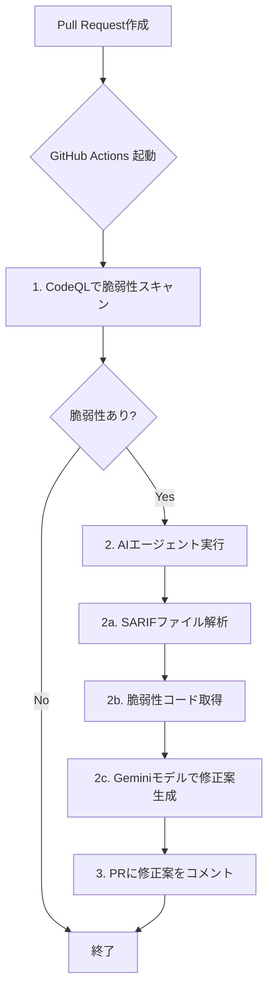

# CodeQLとAIによる脆弱性自動修正システム

このプロジェクトは、GitHub Actions上でCodeQLによる静的解析を実行し、検出された脆弱性をLangChainとGeminiモデル（`gemini-1.5-pro`または`gemini-1.5-flash`）を用いて自動で修正提案するシステムです。

## 🌟 特徴

- **コスト効率**: すべての処理がGitHub Actionsのランナー内で完結するため、追加のサーバーコストがかかりません。
- **自動化**: プルリクエストをトリガーに、脆弱性のスキャンから修正案の提示までを自動で行います。
- **柔軟性**: LangChainベースで構築されているため、プロンプトの調整やロジックの拡張が容易です。
- **セキュア**: 修正はまずプルリクエストへのコメントとして提案されるため、開発者が確認・承認した上で安全にマージできます。

## ⚙️ アーキテクチャ

本システムは、以下のコンポーネントから構成されます。

1.  **GitHub Actions ワークフロー (`.github/workflows/codeql-autofix.yml`)**
    - `pull_request` イベントをトリガーに起動します。
    - CodeQLのアクション (`github/codeql-action`) を用いてコードをスキャンし、結果をSARIF形式で出力します。
    - 脆弱性が検出された場合、後続のステップでAIエージェントのPythonスクリプトを実行します。

2.  **AIエージェント (`autofix_agent/`)**
    - GitHub Actionsのランナー上で直接実行されるPythonスクリプト群です。
    - **`main.py`**: ワークフローから呼び出されるメインスクリプト。SARIFファイルを解析し、LangChainで構築されたエージェント群を制御して修正案を生成します。
    - **`requirements.txt`**: エージェントが必要とするPythonライブラリ（`langchain`, `langchain-google-genai`等）を定義します。
    - **`prompts.py`**: AIモデルに与える指示（プロンプト）を管理します。

### 処理フロー



## 🚀 デプロイと設定手順

このシステムをあなたのリポジトリで有効にするには、以下の手順に従ってください。

### ステップ1: Google AI (Gemini) APIキーの取得

1.  [Google AI Studio](https://aistudio.google.com/) にアクセスします。
2.  Googleアカウントでログインし、「Get API key」をクリックして新しいAPIキーを作成します。
3.  作成したAPIキーを安全な場所にコピーしておきます。

### ステップ2: GitHubリポジトリのシークレット設定

1.  このシステムを導入したいGitHubリポジトリのページに移動します。
2.  「Settings」 > 「Secrets and variables」 > 「Actions」に移動します。
3.  「New repository secret」をクリックします。
4.  名前に `GEMINI_API_KEY` と入力し、値にステップ1で取得したAPIキーを貼り付けて、「Add secret」をクリックします。

### ステップ3: プロジェクトファイルの配置

このリポジトリの `.github` ディレクトリと `autofix_agent` ディレクトリを、あなたのリポジトリのルートにコピー＆ペーストします。

### ステップ4: CodeQLの有効化

お使いのプログラミング言語に合わせて、`.github/workflows/codeql-autofix.yml` ファイル内の `language` 行を適切に設定する必要があります。

```yaml
# .github/workflows/codeql-autofix.yml の一部
# ...
    - name: Initialize CodeQL
      uses: github/codeql-action/init@v3
      with:
        languages: ${{ matrix.language }}
# ...
```

サポートされている言語（`go`, `javascript`, `python`, `ruby`など）については、[CodeQLのドキュメント](https://docs.github.com/ja/code-security/code-scanning/introduction-to-code-scanning/about-code-scanning-with-codeql)を参照してください。

### ステップ5: 動作確認

1.  新しいブランチを作成します。
2.  意図的に脆弱性を含むコード（例: SQLインジェクションの可能性があるコード）を追加または変更します。
3.  変更をコミットし、`main`ブランチへのプルリクエストを作成します。
4.  GitHub Actionsの「Actions」タブで、`CodeQL Autofix` ワークフローが実行されるのを確認します。
5.  脆弱性が検出されると、しばらくしてAIによって生成された修正案がプルリクエストにコメントとして投稿されます。

以上で設定は完了です。
