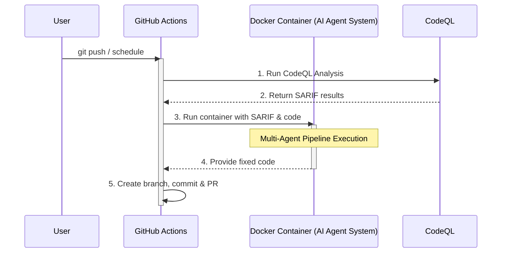
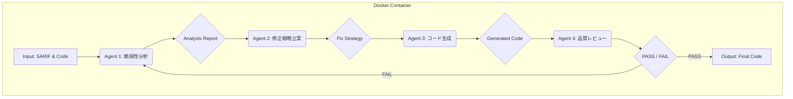

# CodeQL脆弱性自動修正AIエージェント

このプロジェクトは、GitHubリポジトリでCodeQLによって検出されたセキュリティ脆弱性を、自己修正ループを持つシーケンシャル・マルチエージェントシステムが自動的に修正し、プルリクエスト（PR）を作成するAIエージェントです。

## 概要

CodeQLによる静的解析で検出された脆弱性の修正プロセスをAIによって自動化し、開発者がより本質的な開発作業に集中できる環境を構築することを目的としています。品質レビューの結果をAIエージェントにフィードバックすることで、低パラメータLLMでも粘り強く高品質な修正案を生成します。

## アーキテクチャ

### 全体構成



### AIエージェント パイプライン (フィードバックループ付き)



## セットアップと実行

### 前提条件

*   Git
*   Docker

### 1. リポジトリのクローン

```bash
git clone https://github.com/your-username/your-repo-name.git
cd your-repo-name
```

### 2. 環境変数の設定

本エージェントはGemini APIを利用します。APIキーを取得してください。

#### ローカル実行用

プロジェクトのルートに `.env` ファイルを作成し、APIキーを記述します。

```
GEMINI_API_KEY=YOUR_GEMINI_API_KEY
```

#### GitHub Actions用

GitHubリポジトリの `Settings` > `Secrets and variables` > `Actions` で、以下のSecretを登録してください。

*   `GEMINI_API_KEY`: あなたのGemini APIキー。

### 3. Dockerイメージのビルド

```bash
docker build -t codeql-fix-agent .
```

### 4. ローカルでの実行

ローカルでエージェントを実行するには、CodeQLの解析結果であるSARIFファイルと、解析対象のソースコードが必要です。

```bash
docker run --rm \
  --env-file .env \
  -v /path/to/your/sarif.json:/app/sarif.json \
  -v /path/to/your/source_code:/app/code \
  codeql-fix-agent \
  --sarif /app/sarif.json \
  --code-dir /app/code
```

## GitHub Actions ワークフロー

このリポジトリには、2つのワークフローが事前に定義されています。

*   `daily-scan-fix.yml`: 毎日定時にmainブランチをスキャンし、脆弱性があれば修正PRを作成します。
*   `pr-diff-scan-fix.yml`: featureブランチへのPushやPR作成をトリガーに、差分をスキャンして修正PRをfeatureブランチ自身に作成します。

**重要:** ワークフローを有効にするには、YAMLファイル内のDockerイメージ名を、あなたがビルドしてプッシュしたGitHub Container Registry (GHCR) のイメージパスに書き換える必要があります。

1.  DockerイメージをGHCRにプッシュします。([Login参考](https://docs.github.com/ja/packages/working-with-a-github-packages-registry/working-with-the-container-registry#personal-access-token-classic))
    - Bash
    ```bash
    export CR_PAT=YOUR_PAT
    echo $CR_PAT | docker login ghcr.io -u USERNAME --password-stdin
    docker tag codeql-fix-agent ghcr.io/your-username/your-repo-name:latest
    docker push ghcr.io/your-username/your-repo-name:latest
    ```
    - PowerShell
    ```powershell
    $passwd='<YOUR_PAT>'
    echo $passwd | docker login ghcr.io -u <USERNAME> --password-stdin
    docker tag codeql-fix-agent ghcr.io/your-username/your-repo-name:latest
    docker push ghcr.io/your-username/your-repo-name:latest
    ```

2.  `.github/workflows/*.yml` ファイル内の以下の行を修正します。
    ```yaml
    # 修正前
    uses: docker://ghcr.io/your-username/your-repo-name:latest

    # 修正後 (例)
    uses: docker://ghcr.io/my-github-account/my-awesome-agent:latest
    ```

## ライセンス

このプロジェクトは [MIT License](LICENSE) の下で公開されています。
