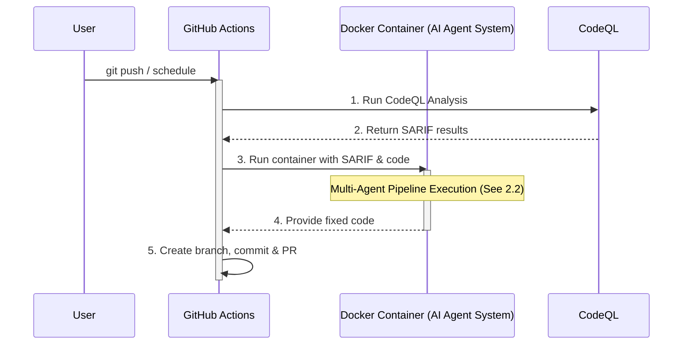
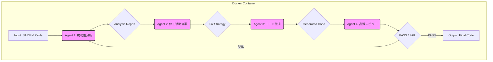

# **CodeQLセキュリティ脆弱性自動修正AIエージェント 設計書 (最終版)**

## **1\. 概要**

### **1.1. 目的**

本ドキュメントは、GitHubリポジトリでCodeQLによって検出されたセキュリティ脆弱性を、**自己修正ループを持つシーケンシャル・マルチエージェントシステム**が自動的に修正する設計について記述する。このシステムはDockerコンテナとしてGitHub Actions上で動作し、**品質レビューの結果をフィードバック**することで、低パラメータLLMでも粘り強く高品質な修正案を生成し、プルリクエスト（PR）作成までを自動化する。

### **1.2. 背景**

Google CloudのSpot Instance上でLLMを実行するプロジェクトにおいて、Publicリポジトリとしてコードを公開している。コードの信頼性と安全性を担保するため、CodeQLによる静的解析を導入しているが、検出された脆弱性の修正には人手による確認と対応が必要であり、これが開発のボトルネックとなる場合がある。この修正プロセスをAIによって自動化し、開発者がより本質的な開発作業に集中できる環境を構築する。

## **2\. システムアーキテクチャ**

### **2.1. 全体構成図**

### **2.2. AIエージェント パイプライン構成 (フィードバックループ付き)**

コンテナ内で実行されるAIエージェントは、4つの専門エージェントが逐次的に処理を行うパイプラインを構成する。**Agent 4のレビュー結果がFAILの場合、そのフィードバックと共にAgent 1の処理から再試行するループ構造を持つ。**

## **3\. AIエージェント詳細設計**

### **3.1. Agent 1: 脆弱性分析エージェント (Vulnerability Analyzer)**

* **役割:** 脆弱性の根本原因を特定し、自然言語で解説する。  
* **入力:**  
  * **初回実行時:** CodeQLの警告（ファイル、行、CWE、メッセージ）、脆弱なコードスニペット。  
  * **再試行時:** 上記に加え、**Agent 4からの「失敗理由」フィードバック**。  
* **処理:**  
  * 初回は、コードのどの部分が、なぜ問題なのかを分析する。  
  * 再試行時は、前回の失敗理由を考慮して、より深く、または異なる観点から脆弱性を再分析する。  
* **出力:** 構造化された分析レポート。

### **3.2. Agent 2: 修正戦略立案エージェント (Fix Strategy Planner)**

* **役割:** Agent 1の分析レポートに基づき、コードを修正するための具体的な手順（戦略）を立案する。  
* **入力:** Agent 1の分析レポート、脆弱なコードスニペット。  
* **処理:** コードを書かずに、修正のためのステップを箇条書きで記述する。  
* **出力:** 修正戦略。

### **3.3. Agent 3: コード生成エージェント (Code Generator)**

* **役割:** Agent 2が立案した戦略に従って、実際に修正後のコードを生成する。  
* **入力:** Agent 2の修正戦略、脆弱なコードスニペット。  
* **処理:** 指示された戦略を忠実に実装する。  
* **出力:** 修正後のコードブロックのみ。

### **3.4. Agent 4: 品質レビューエージェント (Quality Reviewer)**

* **役割:** 生成されたコードが当初の問題を解決しているか、新たな問題を生んでいないかを確認する。  
* **入力:** Agent 1の初回分析レポート、Agent 3の生成コード、元の脆弱なコード。  
* **処理:** 「Agent 1が指摘した問題は、Agent 3のコードで解決されているか？」という観点で比較検証する。  
* **出力:**  
  * PASS: 修正が妥当であると判断。パイプラインは正常に終了する。  
  * FAIL と **失敗理由**: 修正が不十分、または新たな問題を引き起こしていると判断した場合、なぜ失敗したのかを具体的に記述したフィードバックを生成する。このフィードバックは、次のループでAgent 1に渡される。

## **4\. コンテナ化戦略とワークフロー**

### **4.1. Dockerfile / イメージ管理**

AIエージェントの実行に必要な依存関係を定義したDockerfileを作成し、ビルドしたイメージは\*\*GitHub Container Registry (GHCR)\*\*で管理する。

* **ビルドとプッシュ:** mainブランチにAIエージェントのコードがマージされた際に、イメージをビルドしてGHCRにプッシュする専用のワークフローを設ける。  
* **バージョニング:** Gitのコミットハッシュやタグを用いてイメージにバージョンを付け、利用するバージョンを明確にする。

\# ベースイメージ  
FROM python:3.11-slim

\# 作業ディレクトリの設定  
WORKDIR /app

\# 必要なライブラリをインストール  
COPY requirements.txt .  
RUN pip install \--no-cache-dir \-r requirements.txt

\# エージェントのソースコードをコピー  
COPY . .

\# コンテナ実行時のデフォルトコマンド  
ENTRYPOINT \["python", "main.py"\]

### **4.2. ワークフロー1: mainブランチ定期スキャン (daily-scan-fix.yml)**

* **トリガー:** schedule (毎日)  
* **処理概要:**  
  1. **Checkout:** mainブランチのコードをチェックアウトする。  
  2. **CodeQLスキャン:** mainブランチ全体をスキャンし、SARIFファイルを出力する。  
  3. **Run AI Agent:** GHCRからAIエージェントのDockerイメージをpullし、コンテナを起動する。その際、ソースコードとSARIFファイルをコンテナから読み書きできるようボリュームマウントし、APIキーなどの秘匿情報を環境変数として渡す。  
  4. **Pull Request作成:** コンテナが生成した修正パッチを元に、mainブランチへのPRを作成する。

### **4.3. ワークフロー2: featureブランチ差分スキャン (pr-diff-scan-fix.yml)**

* **トリガー:** push (featureブランチ), pull\_request  
* **処理概要:**  
  1. **Checkout:** featureブランチのコードをチェックアウトする。  
  2. **CodeQLスキャン（差分）:** PRのbaseとheadの差分をスキャンし、SARIFファイルを出力する。  
  3. **Run AI Agent:** ワークフロー1と同様に、コンテナを実行してAIエージェントパイプラインを起動する。  
  4. **Pull Request作成:** コンテナが生成した修正パッチを元に、**featureブランチ自身をターゲット**としたPRを作成する。

## **5\. セキュリティと考慮事項**

### **5.1. APIキーの管理**

* Gemini APIのキーは、リポジトリのSettings \> Secrets and variables \> ActionsでGEMINI\_API\_KEYとして登録する。  
* ワークフロー内では${{ secrets.GEMINI\_API\_KEY }}として参照し、コードやログに直接キーが露出しないように徹底する。

### **5.2. 無限PR作成の防止**

* AIが生成した修正が新たな脆弱性を生み、次のスキャンで再度修正PRが作られる、という無限ループを避ける必要がある。  
* **対策:** AIが作成したPRには特定のラベル（例: ai-generated）を付与し、このラベルを持つPRをトリガーとしたワークフローは実行しないように設定する。

### **5.3. 修正コードのレビュー**

* AIによる自動修正はあくまで「提案」であり、その内容が常に正しいとは限らない。  
* 生成されたPRは必ず人間の開発者がレビューし、意図しない変更や新たなバグが含まれていないかを確認した上でマージするプロセスを徹底する。自動マージは原則として行わない。

### **5.4. コスト管理**

* LLM APIの利用はコストが発生するため、APIコール数を監視する。  
* GitHub Actionsの実行時間にも上限があるため、処理が長時間に及ばないようにスクリプトの効率化を図る。特に、一度に大量の脆弱性が検出された場合の処理方法（例: 1回の実行で修正する脆弱性の上限数を設ける）を検討する。

### **5.5. 無限修正ループの防止 (Retry Loop Prevention)**

* **再試行カウンターの実装:** AIエージェントのパイプラインは、脆弱性ごとに最大再試行回数を設定する（例: **3回**）。  
* **上限到達時の処理:** カウンターが上限に達してもPASSしない場合、その脆弱性の自動修正は「失敗」とみなし、パイプラインを停止する。GitHub Actionsのログに詳細なエラーメッセージを出力し、開発者に手動での対応を促す。